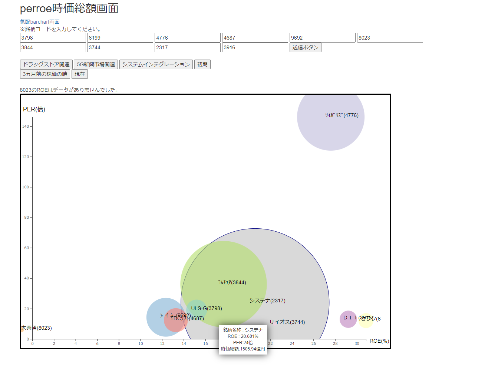
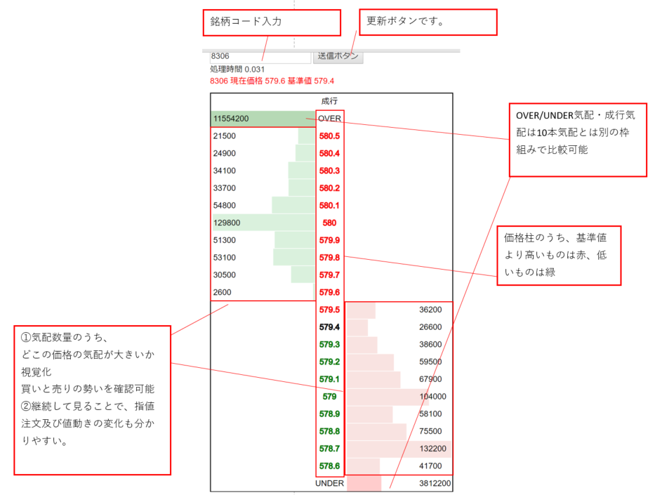
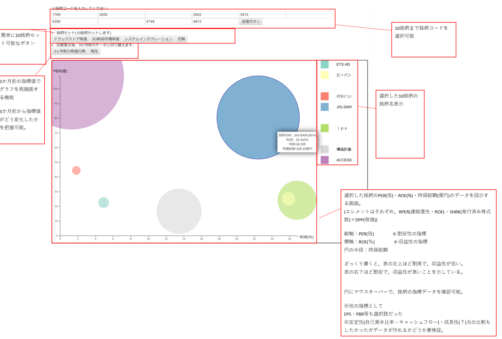

# D3.jsを使って株価データ図示
 I try to visualize Japanese stock market data graphically  using D3.js
 If you want to try my source code, please contact me 
 because it uses unpublished APIs

###### あまり顧みていないので、ここに整理と供養
国内に上場している株の気配やPER,時価総額を応答してくれるAPIを使うことができたので
フロントエンドのみで株価データを図示してみようという思い付き

## できたもの
1. 気配情報の棒グラフ(barchart)化([main.html](/main.html))

2. 複数銘柄の指標をバブルチャートにして表示([per.html](/per.html))

3. 時系列のヒートマップ(仮・未実装)
4. 決算情報(仮・未実装)

## 簡単な説明
#### 1.  銘柄コード(4,5桁数値)を入力して送信ボタンを押すと、銘柄の気配を表示する

ポイント

- 中央の価格柱は前日終値と比較して色を付ける(SBI証券株アプリ仕様)
- 気配量に応じて棒グラフ化して買いと売りの勢いを可視化
- OVERとUNDER気配はOVERとUNDER気配だけで比較(10本気配とは異なる枠組みで比較)

#### 2. 銘柄コード(4,5桁数値)を10個入力することで、銘柄間のPER,ROE,時価総額を比較可能とする。

ポイント

- グラフは縦軸PER、横軸ROE ざっくり右下ほど割安で収益性が高い
- 〇の大きさは時価総額を表す
- 10銘柄入力するのがどうみても面倒なので、銘柄セットをセットできるボタンを置いておいた
- 個人的に、過去の数値と比較できると面白そうだったので、3か月前の状況にすることができるボタンも設置
- いくつかの図は円がCanvasからはみ出ているが、軸からはみ出ないようにしている
- [ちょっと参考にしたサイト](https://archive.nytimes.com/www.nytimes.com/interactive/2012/05/17/business/dealbook/how-the-facebook-offering-compares.html)

## D3.jsの簡単な理解

- インタラクティブな画面を作成可能。⇔Charts.js,highcharts.js(チャート表示のみ)
- SVG利用(D3.js,highcharts.js)⇔Canvas利用(Charts.js)

※SVGはデータごとにオブジェクト形式を持っている。半面、データ数が多いと描画に時間がかかる。

どんなものが作成可能かは[こちら](https://github.com/d3/d3/wiki/Gallery)参照

## 今後の課題
- 欠損値の扱い。欠損値表示時は画面にも欠損地であることを表示している。
- 複数銘柄比較は、何かで制御しないとデータが大きすぎ、小さすぎで見えずらくなるので、Max,Min値を設けるべき

